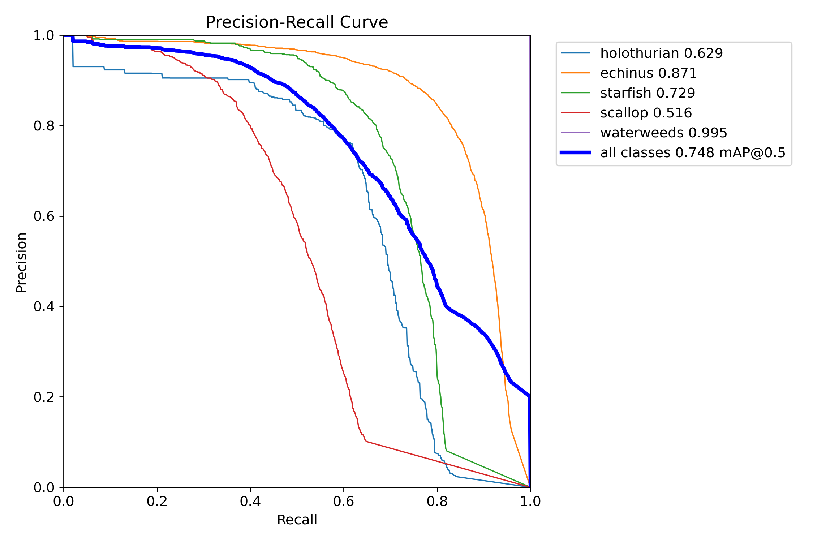
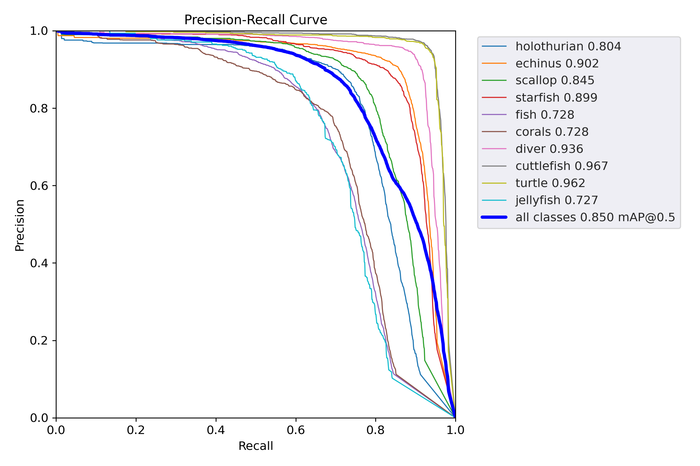

# AMSP-UOD | AAAI-24
```
The 38th Annual AAAI Conference on Artificial Intelligence (AAAI), 2024
```
This is an official PyTorch implementation of paper [AMSP-UOD: When Vortex Convolution and Stochastic Perturbation Meet Underwater Object Detection](https://arxiv.org/abs/2308.11918)


## Quick Start

This code repository includes the base run code for AMSP-UOD, see folder `./weights` for the weights file, and see folder `./result` for the PR curve graph. There is some of the urpc test data in folder `./urpc`, and you can get the recognition results using `./det.sh`

### 1. Deploy Conda environment
```Command Line
conda create -n AMSP_UOD python==3.10
```

### 2. Install package dependencies
```Command Line
pip install -r requirements.txt
```

### 3. Train Model (Optional, requires Datasets and Cuda)
Our default code uses NMS-Similar algorithm from the paper, and you should either turn off val validation or post-process that use the traditional NMS algorithm before training.
This is done by switching the file `./utils/general.py` from lines 950 to 953.
```Command Line
conda activate AMSP_UOD
./train.sh 0
```

### 4. Test Model (Optional, requires Datasets and Cuda)
Note that when testing model performance, change the val option in urpc.yaml from self-divided data to urpc's B-list data.
```Command Line
conda activate AMSP_UOD
./val.sh
```

### 5. Dectet
```Command Line
conda activate AMSP_UOD
./det.sh
```

### Showcase

#### URPC

#### RUOD


For more details check out `./result` folder, we give the experimental result plots for some of the ablation experiments.

## Cite
You can cite our work in the following format:

### arXiv
```bibtex
@article{zhou2023amsp,
  title={AMSP-UOD: When Vortex Convolution and Stochastic Perturbation Meet Underwater Object Detection},
  author={Zhou, Jingchun and He, Zongxin and Lam, Kin-Man and Wang, Yudong and Zhang, Weishi and Guo, ChunLe and Li, Chongyi},
  journal={arXiv preprint arXiv:2308.11918},
  year={2023}
}
```

### AAAI-24
```bibtex
@inproceedings{AMSP-UOD,
  title={AMSP-UOD: When Vortex Convolution and Stochastic Perturbation Meet Underwater Object Detection},
  author={Zhou, Jingchun and He, Zongxin and Lam, Kin-Man and Wang, Yudong and Zhang, Weishi and Guo, ChunLe and Li, Chongyi},
  booktitle={Proceedings of the AAAI Conference on Artificial Intelligence},
  volume={38},
  number={7},
  pages={7659--7667},
  year={2024}
}
```
